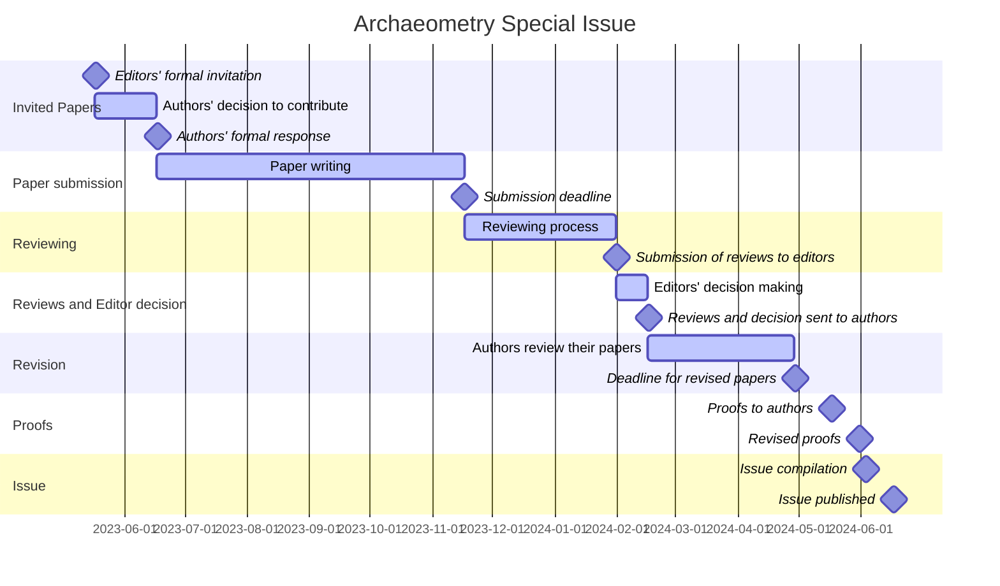

# Archaeometry Special Issue
> Publication of an Archaeometry Special Issue on Chronological Modeling

- [time table](https://github.com/historical-time/archaeometry-si#timeline)
- [data samples](https://github.com/historical-time/archaeometry-si#data-samples)

## Timeline

(click on ↔️ to enlarge the time table)

## Data samples

We invite authors to upload samples of their data to this GitHub repository: [data-samples/](https://github.com/historical-time/data-samples#examples-of-historical-time-representation). The aim is to align heterogeneous time data used in the special issue using [CIDOC-CRM](https://github.com/historical-time/projects-tools-standards/tree/main/standards/cidoc-crm), [EDTF](https://github.com/historical-time/projects-tools-standards/tree/main/standards/edtf) -- or any convenient standards -- and possibly to publish a collective paper on this topic
