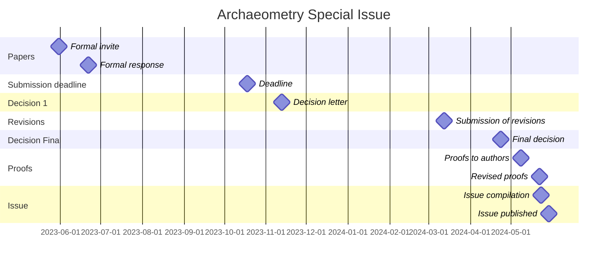

# Archaeometry Special Issue
> Publication of an Archaeometry Special Issue on Chronological Modeling

[Chronological domain list](https://github.com/historical-time/caa23/issues/5)

## Timeline

# Dataset samples
> Use of standards to share dates between different research projects

Authors are asked to share samples of their temporal data using standardised formats, using:
- **EDTF**[^1] isostandard to record an event or a duration
- **CIDOC-CRM**[^2] to record relations between events or durations, actors and places can be modelled with the CIDOC-CRM

For example: 

 
<em>A CIDOC-CRM example for the dating of the Thera-Santorini volcano eruption ([HTML widget](https://historical-time.github.io/caa23/www/thera-cidoc-graph.html) screenshot)</em>

This CIDOC representation of Thera eruptionis build upon this list of nodes ([thera-cidoc-data-nodes.tsv](https://github.com/historical-time/data-samples/blob/main/cidoc-crm/thera-cidoc-data-nodes.tsv)) and edges ([thera-cidoc-data-edges.tsv](https://github.com/historical-time/data-samples/blob/main/cidoc-crm/thera-cidoc-data-edges.tsv))[^3]. 

* It gathers different interpretation of the Thera-Santorini eruption datation by Burnouf, Long Perrier, etc.
* It records dates in a EDTF format (entities: E2, E5 and E52)

[^1]: Extended Time and date format (EDTF, ISO 8601-2:2019) is the isostandard for dates. See: http://www.loc.gov/standards/datetime/
[^2]: CIDOC-Conceptual Reference Model (CIDOC-CRM, v7.1.2 *under review* ISO) is a model for describing and organising cultural heritage information. It is extended to archaeological data with the [CRMarchaeo](https://www.cidoc-crm.org/crmarchaeo/home-3). See: https://www.cidoc-crm.org/
[^3]: The original dataset is a XLSX file, [data.xlsx](https://github.com/eamena-project/eamena-arches-dev/blob/main/data/lod/data.xlsx) that can be downloaded.
