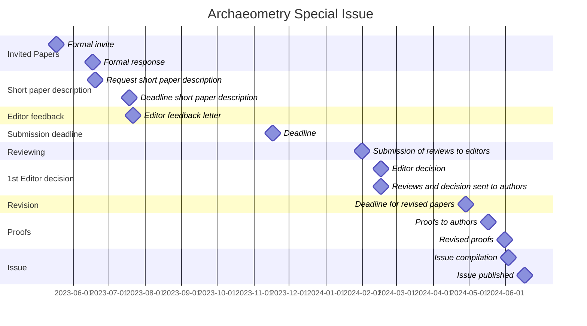

# Archaeometry Special Issue
> Publication of an Archaeometry Special Issue on Chronological Modeling

---

 
  
🚧 README page under construction 🚧 
  

---

- [time table](https://github.com/historical-time/archaeometry-si#timeline)
- [data samples](https://github.com/historical-time/archaeometry-si#data-samples)
- [standards and isostandards](https://github.com/historical-time/archaeometry-si#standards-and-isostandards)

## Timeline

## Data samples
> Use of standards to share dates between different research projects

In order line-up heterogeneous time data in a FAIR perspective[^4], we invite authors to deposit samples of their data on GitHub. The aim is to map chronologies using the [CIDOC-CRM](https://github.com/historical-time/archaeometry-si#cidoc-crm).

For each archaeological event or duration, dated by **absolute chronology**, the minimal required information for each sample are the Peuquet's triad dimensions (What, When, Where):

| What | When | Where |
|------|------|-------|
| Thera-Santorini volcano eruption | -2000/-1500 | Egean sea |

If the archeological event has a relative chronology, i.e. is dated relatively to another event, this relationship should be mentionned using temporal logic:

| What | When | Where |
|------|------|-------|
| Thera-Santorini volcano eruption | *before* Minoean palace collapse | Egean sea |
| Minoean palace collapse | 1500 | Egean sea |

### What

### When

The format should be, as possible, the [EDTF](https://github.com/historical-time/archaeometry-si#edtf) isostandard to record an event or a duration

### Where

## Standards and isostandards

### Temporal logic

Allen's, CIDOC CRM

### EDTF

EDTF[^1]
### CIDOC-CRM

CIDOC-CRM[^2]

 
<em>A CIDOC-CRM example for the dating of the Thera-Santorini volcano eruption ([HTML widget](https://historical-time.github.io/caa23/www/thera-cidoc-graph.html) screenshot)</em>

This CIDOC representation of Thera eruptionis build upon this list of nodes ([thera-cidoc-data-nodes.tsv](https://github.com/historical-time/data-samples/blob/main/cidoc-crm/thera-cidoc-data-nodes.tsv)) and edges ([thera-cidoc-data-edges.tsv](https://github.com/historical-time/data-samples/blob/main/cidoc-crm/thera-cidoc-data-edges.tsv))[^3]. 

* It gathers different interpretation of the Thera-Santorini volcano eruption datation by Burnouf, Long Perrier, etc.
* It records dates in a EDTF format (entities: E2, E5 and E52)

[^1]: Extended Time and date format (EDTF, ISO 8601-2:2019) is the isostandard for dates. See: http://www.loc.gov/standards/datetime/
[^2]: CIDOC-Conceptual Reference Model (CIDOC-CRM, v7.1.2 *under review* ISO) is a model for describing and organising cultural heritage information. It allows to record relations between events or durations, actors and places can be modelled with the CIDOC-CRM. It is extended to archaeological data with the [CRMarchaeo](https://www.cidoc-crm.org/crmarchaeo/home-3). See: https://www.cidoc-crm.org/
[^3]: The original dataset is a XLSX file, [data.xlsx](https://github.com/eamena-project/eamena-arches-dev/blob/main/data/lod/data.xlsx) that can be downloaded.
[^4]: Findable, Accessible, Interoperable, Reusable
