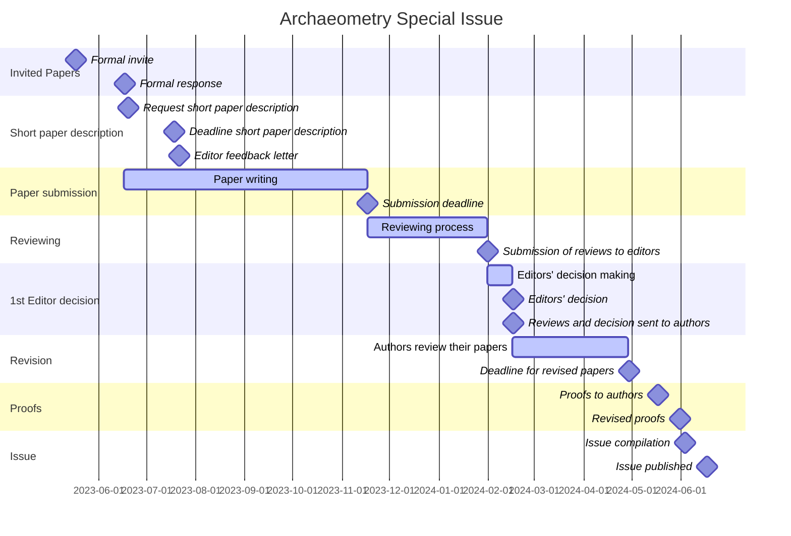

---

 
🚧 README page under construction 🚧  

---

# Archaeometry Special Issue
> Publication of an Archaeometry Special Issue on Chronological Modeling

- [time table](https://github.com/historical-time/archaeometry-si#timeline)
- [data samples](https://github.com/historical-time/archaeometry-si#data-samples)
- [standards and isostandards](https://github.com/historical-time/archaeometry-si#standards-and-isostandards)

## Timeline

## Data samples
> Use of standards to share dates between different research projects

We invite authors to deposit samples of their data on this GitHub: [data-samples/](https://github.com/historical-time/data-samples#examples-of-historical-time-representation). The aim is to line-up heterogeneous chronological data coming from the special issue outlet using [CIDOC-CRM](https://github.com/historical-time/projects-tools-standards/tree/main/standards/cidoc-crm) and [EDTF](https://github.com/historical-time/projects-tools-standards/tree/main/standards/edtf). 

## Building LOD

In order  time data in a FAIR perspective[^4], 

For each archaeological event or duration, dated by **absolute chronology**, the minimal required information for each sample are the Peuquet's triad dimensions (What, When, Where):

| What | When | Where |
|------|------|-------|
| Thera-Santorini volcano eruption | -2000/-1500 | Egean sea |

If the archeological event has a relative chronology, i.e. is dated relatively to another event, this relationship should be mentionned using temporal logic:

| What | When | Where |
|------|------|-------|
| Thera-Santorini volcano eruption | *before* Minoean palace collapse | Egean sea |
| Minoean palace collapse | -1450 | Egean sea |

In both cases the format for temoral data (*When*) should be, as possible, the [EDTF](https://github.com/historical-time/archaeometry-si#edtf)

[^3]: The original dataset is a XLSX file, [data.xlsx](https://github.com/eamena-project/eamena-arches-dev/blob/main/data/lod/data.xlsx) that can be downloaded.
[^4]: Findable, Accessible, Interoperable, Reusable
